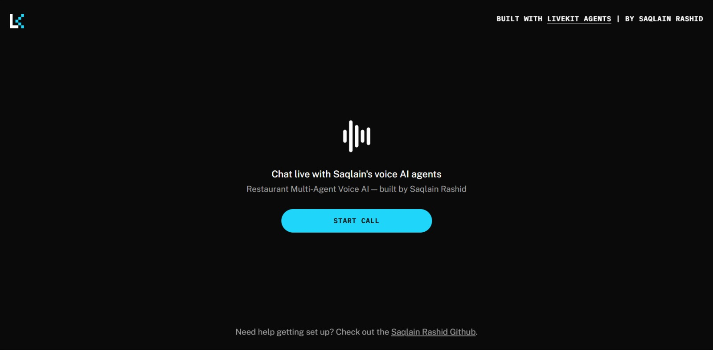

# Restaurant Voice AI — Multi-Agent System (LiveKit + Groq + ElevenLabs)

A real-time voice AI system for restaurant reservations and takeaway orders. Four specialized agents hand off the conversation to each other based on customer intent, backed by a triple-redundant TTS pipeline for reliability.

🔴 **[Live Demo](https://restaurant-frontend-azure-gamma.vercel.app)** — talk to it in your browser, no signup needed




---

## Why Multi-Agent?

A single LLM juggling "take reservation," "take order," and "process payment" in one prompt gets messy fast. Instead, this splits responsibilities into 4 agents that pass the conversation between each other, each with its own system prompt, tools, voice, and shared memory (`UserData`) so context isn't lost on handoff.

```
                    ┌─────────────┐
                    │   Greeter   │  ← entry point, routes the call
                    └──────┬──────┘
                ┌──────────┴──────────┐
                ▼                     ▼
        ┌───────────────┐    ┌───────────────┐
        │  Reservation  │    │   Takeaway    │
        └───────┬───────┘    └───────┬───────┘
                │                     ▼
                │             ┌───────────────┐
                │             │   Checkout    │
                │             └───────┬───────┘
                └──────────┬──────────┘
                           ▼
                    (back to Greeter)
```

---

## Tech Stack

| Component | Tool | Notes |
|---|---|---|
| Framework | [LiveKit Agents](https://github.com/livekit/agents) | Real-time audio pipeline, turn detection, room management |
| STT | Groq Whisper (`whisper-large-v3-turbo`) | Free tier |
| LLM | Groq Llama 3.3 70B (`llama-3.3-70b-versatile`) | Free tier, tool-calling, low temperature for consistency |
| TTS | **3-provider fallback chain**: ElevenLabs → Cartesia → Groq Orpheus | If one provider fails or rate-limits mid-call, the next one seamlessly picks up the same turn |
| Transport | LiveKit Cloud | Free tier, deployed via `lk` CLI |
| Frontend | Next.js (LiveKit React starter), deployed on Vercel | [Separate repo](https://github.com/Py-saqlain/restaurant-voice-agent-ui) |

**Zero-cost stack** — every provider used has a free tier; no paid APIs required to run this.

---

## Project Structure

```
restaurant-agent-system/
├── main.py                  # Entrypoint - wires agents into a session
├── agents/
│   ├── greeter.py            # Routes customer to reservation or takeaway
│   ├── reservation.py        # Collects reservation details
│   ├── takeaway.py           # Collects food order
│   └── checkout.py           # Collects payment, finalizes order
├── shared/
│   ├── user_data.py          # Shared state + tools across all agents
│   └── base_agent.py         # Handoff logic + shared communication style
└── requirements.txt
```

---

## Architecture Details

- **`UserData`** — shared state (name, phone, reservation time, order, payment info) that persists across agent handoffs.
- **`BaseAgent`** — parent class handling handoff logic: on entering, each agent pulls a trimmed slice of prior chat history and injects current `UserData` into its context, so it doesn't ask the customer to repeat themselves.
- **`COMMUNICATION_STYLE`** — a shared instruction block every agent inherits, keeping responses natural and preventing the model from reading back internal tool confirmations verbatim.
- **Function tools** (`@function_tool`) — the LLM decides when to call these (e.g. `update_name`, `confirm_reservation`) based on conversation flow; not manually parsed.
- **TTS fallback chain** — wraps 3 independent TTS providers in `tts.FallbackAdapter`, so a single provider's rate limit or outage doesn't end the call.

---

## Setup

### 1. Clone & install
```bash
git clone https://github.com/Py-saqlain/livekit-restaurant-assistant.git
cd livekit-restaurant-assistant
python -m venv venv
venv\Scripts\activate        # Windows
pip install -r requirements.txt
```

### 2. Get free API keys
- **LiveKit Cloud**: [cloud.livekit.io](https://cloud.livekit.io) → create project → Settings → Keys
- **Groq**: [console.groq.com](https://console.groq.com) → API Keys (accept terms for `canopylabs/orpheus-v1-english` once at the playground)
- **ElevenLabs**: [elevenlabs.io/app/api](https://elevenlabs.io/app/api) → 10k free chars/month
- **Cartesia**: [play.cartesia.ai](https://play.cartesia.ai) → free tier

### 3. Configure `.env`
```
LIVEKIT_URL=wss://your-project.livekit.cloud
LIVEKIT_API_KEY=your_key
LIVEKIT_API_SECRET=your_secret
GROQ_API_KEY=your_groq_key
ELEVEN_API_KEY=your_elevenlabs_key
CARTESIA_API_KEY=your_cartesia_key
```

### 4. Run locally
```bash
python main.py download-files   # one-time model download
python main.py console            # talk to it directly via terminal mic/speaker
```

---

## Deploying to LiveKit Cloud

Once you've tested locally and are happy with a change:

```bash
# push updated secrets (only needed if .env changed)
lk agent update --secrets-file .env

# deploy the latest code
lk agent deploy

# confirm it's live
lk agent status --id <your-agent-id>
```

**Note:** deploying here does *not* automatically update the frontend or push to GitHub — those are separate steps:
```bash
git add .
git commit -m "describe your change"
git push
```

---

## Example Interaction

```
User: Hi, I'd like to make a reservation
Agent (Greeter → Reservation): Sure! What time works for you?
User: 7 PM tonight
Agent: Great, could I get your name and phone number?
User: John Smith, 0300-1234567
Agent: Confirming — reservation for John Smith at 7 PM, phone 0300-1234567. Correct?
```

---

## Project Status

Built as a production-style multi-agent voice AI system using LiveKit + Groq + ElevenLabs + Cartesia. Demonstrates:
- Real-time STT/LLM/TTS pipeline with automatic multi-provider failover
- Multi-agent handoff with shared state
- Free-tier-only infrastructure
- Deployed and publicly accessible via a custom frontend

## Author

**Saqlain Rashid** — BS Software Engineering, PUCIT | AI Intern @ Senarios
[GitHub](https://github.com/Py-saqlain) · [HuggingFace](https://huggingface.co/py-saqlain)
